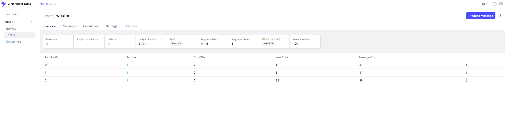
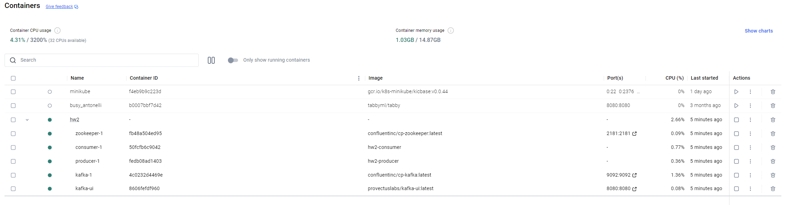

# Kafka Weather System (Система обработки погоды на основе Kafka)

Этот проект демонстрирует систему обработки данных о погоде в реальном времени с использованием Apache Kafka, Docker и Python. Система состоит из продюсера, который генерирует данные о погоде, и потребителя, который обрабатывает и сохраняет данные в базу данных SQLite.

#Шаги выполнения:
Настройка кластера Kafka:
- Установите и запустите локальный кластер Apache Kafka. Вы можете использовать Docker для упрощения установки.
--Создайте топик, например, «weather», с несколькими разделами (например, 3).
-Создание продюсера:
--Напишите приложение на Python, которое будет отправлять сообщения о погоде в топик weather.
--Каждое сообщение должно содержать информацию о погоде (например, {"city": "Moscow", "temperature": 5, "condition": "cloudy"}).
--Используйте библиотеку kafka-python для Python.
--Подсказка: Используйте случайные данные  для генерации сообщений.
-Создание потребителя:
--Напишите приложение-потребитель, которое будет считывать сообщения из топика weather.
--Обработайте каждое сообщение и сохраняйте в базе данных.

Установка

1. Клонирование репозитория

git clone https://github.com/Niktyav/infraBigData
cd infraBigData/hw2

2. Запуск Kafka локально через Docker Compose

docker-compose up -d

3. Просмотр результатов работы

результаты находятся в папке 'database' и могут быть просмотрены с использованием соответствующих средств
например для JSON - notepad++

Topic "weather" с 3 патрициями:   
   

Состояние docker-compose:
   